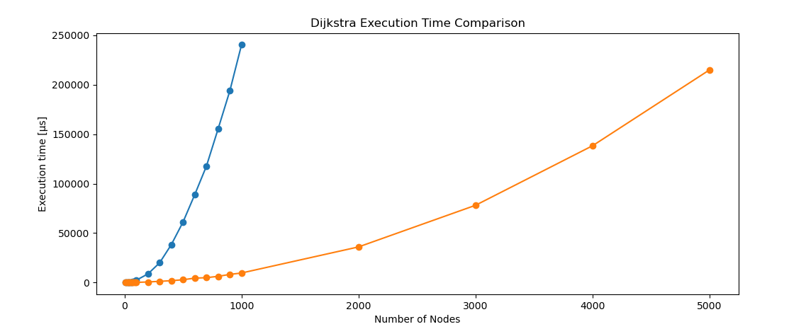

# Graph Explorer

C++ graph exploration with shortest-path-scanner project focused on:

* scalable graph data structures
* adjacency matrix to adjacency list conversion
* Lazy Dijkstra shortest-path algorithm
* Unit testing with GoogleTest
* Benchmarking and Runtime Profiling

--- 
### Quick context:  
Graphs can be used to model an enormous amount of things in the world.  
I can use graphs to model probabilistic events, analog and digital electronics circuits, the sequences of few elements    
extracted from a jar, maps and so on... This makes their utilization so powerful that a lot of my tasks at work, are enormously simplified.  
In my job I often use graphs to create scalable software or simply to put order to a chaotic POC a colleague of mine created.  
But at work I am exposed too much to Python programming, and some concepts start fading out after months of high-level languages...  
So in general, a refresh is needed sometimes 😊.  
In this project I aim to perform an experiment over one of the most famous algorithms of all time (Lazy Dijkstra).  
Here an undirected-non-negative-weighted graph is a must to run Dijkstra and in the main.cpp that graph is created.  
In the creation of that graph I inserted a 15/21 probability of zero value --> increase sparsity statistically.  
The created adjacency matrix is passed to the Graph Class that builds up a more scalable nested-object-like structure adjacency list based.  
Adjacency matrices are pretty handy sometimes and generating graphs is more immediate (to me), but some algorithms run pretty bad on  
adjacency matrices and using lists is faster, which is more convenient for certain applications.
Last thing, below there is a chart exposing the runtime benchmark for the algorithms and initially I made a mistake. I implemented a  
priority queue max-heap based and then, the execution time exploded. After having learned the lesson, I corrected to implement a min-heap one.  
After having seen the execution time becoming O(E log E) - like instead of quadratic, I could start sleeping well again at night.

---

## Project Structure

```text
0_graph_explorer/
├── CMakeLists.txt
├── include/
│   ├── edge.h
│   ├── graph.h
│   └── node.h
├── src/
│   ├── edge.cpp
│   ├── graph.cpp
│   ├── main.cpp
│   └── node.cpp
├── tests/
│   ├── test_edge.cpp
│   ├── test_graph.cpp
│   └── test_node.cpp
└── images/
    └── exec_time_benchmark.png
```

---

## Features

### Graph Representation

The graph is initially generated as a weighted adjacency matrix and internally converted into an adjacency-list representation.

#### Sparse Graph 

Zero or negative weights are ignored during node construction:

* `0` represents no connection
* only positive-weight edges are stored
* 15/21 probability of zero value
* Diagonal elements are null

This is done for creating an undirected weighted graph.

---

## Lazy Dijkstra Algorithm

The project implements a lazy version of Dijkstra's shortest-path algorithm using:

* adjacency lists
* `std::priority_queue`
* min-heap ordering via `std::greater<>`

The algorithm returns:

* shortest-path distance
* reconstructed shortest path

---

## Unit Testing

Testing is implemented with GoogleTest.

Covered components:

### Edge

* constructor correctness
* getter correctness
* vector storage compatibility

### Node

* empty neighbor handling
* sparse graph behavior
* zero-weight edge skipping
* negative-weight skipping
* adjacency construction validation

### Graph

* shortest path correctness
* disconnected graph handling
* path reconstruction
* distance validation

---

# Benchmarking

The project includes runtime profiling experiments for Dijkstra's algorithm.

Benchmarking currently explores:

* runtime scaling
* heap ordering effects
* average execution time across multiple randomized graphs

The runtime is measured using:

```cpp
std::chrono::high_resolution_clock
```

and averaged over multiple independent runs. 

Here below the results: 
* Orange Plot: Min-heap implementation 
* Blue Plot: Max-heap implementation (implemented by mistake by the author initially)  



## Current Observations

* Incorrect max-heap ordering drastically worsens performance.
    ```text
    ≈O(V²)
    ```
* Proper min-heap ordering restores expected Dijkstra behavior.
    ```text
    O(E log E)
    ```
---

# Learning Goals

This project is intended as both:

* a graph-algorithm implementation project
* a systems-programming and modern C++ learning project

with focus on:

* algorithmic complexity
* memory ownership
* RAII
* testing
* profiling
