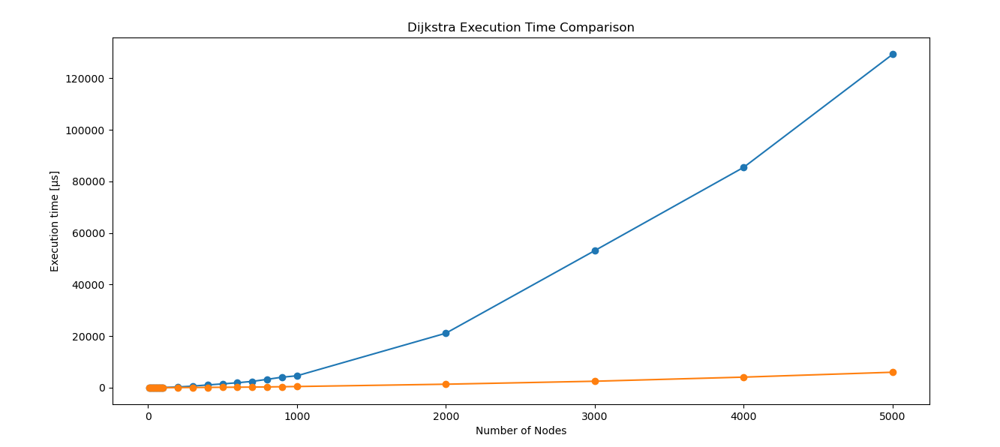

# Graph Explorer

C++ graph exploration with shortest-path-scanner project focused on:

* scalable graph data structures
* adjacency matrix to adjacency list conversion
* cache-aware flat adjacency list representation
* Lazy Dijkstra shortest-path algorithm
* Unit testing with GoogleTest
* Benchmarking and Runtime Profiling

--- 
### Quick context:  
Graphs can be used to model an enormous amount of things in the world.  
I can use graphs to model probabilistic events, analog and digital electronics circuits, the sequences of few elements    
extracted from a jar, maps and so on... This makes their utilization so powerful that a lot of my tasks at work, are enormously simplified.  
In my job I often use graphs to create scalable software or simply to put order to a chaotic POC a colleague of mine created.  
But at work I am exposed too much to Python programming, and some concepts start fading out after months of high-level languages...  
So in general, a refresh is needed sometimes 😊.  
In this project I aim to perform an experiment over one of the most famous algorithms of all time (Lazy Dijkstra).  
Here an undirected-non-negative-weighted graph is a must to run Dijkstra and in the main.cpp that graph is created.  
In the creation of that graph I inserted a 15/21 probability of zero value --> increase sparsity statistically.  
The created adjacency matrix is passed to two Graph implementations that build up different adjacency list structures for comparison purposes.  
Adjacency matrices are pretty handy sometimes and generating graphs is more immediate (to me), but some algorithms run pretty bad on  
adjacency matrices and using lists is faster, which is more convenient for certain applications.  
Last thing, below there is a chart which exposes the runtime benchmark for the algorithms. Initially I made a mistake:  
I implemented a priority queue max-heap based and then, the execution time exploded. After having learned the lesson, I corrected to implement a min-heap one.  
After having seen the execution time becoming O(E log E) instead of quadratic, I could start sleeping well again.

---

# Learning Goals

This project is intended as both:

* a graph-algorithm implementation project
* a systems-programming and modern C++ learning project

with focus on:

* algorithmic complexity
* cache-aware data structure design
* memory layout and contiguous storage
* memory ownership
* RAII
* testing
* profiling

---

## Project Structure

```text
0_graph_explorer/
├── CMakeLists.txt
├── include/
│   ├── edge.h
│   ├── graph.h
│   ├── graph_flat.h
│   └── node.h
├── src/
│   ├── edge.cpp
│   ├── graph.cpp
│   ├── graph_flat.cpp
│   ├── main.cpp
│   └── node.cpp
├── tests/
│   ├── test_edge.cpp
│   ├── test_graph.cpp
│   ├── test_graph_flat.cpp
│   └── test_node.cpp
└── images/
    ├── exec_time_benchmark.png
    └── exec_time_benchmark_flat_vs_nested.png
```

---

## Features

### Graph Representation

The graph is initially generated as a weighted adjacency matrix and internally converted into an adjacency-list representation.
Two implementations are provided and benchmarked against each other.

#### Sparse Graph 

Zero or negative weights are ignored during construction:

* `0` represents no connection
* only positive-weight edges are stored
* 15/21 probability of zero value
* Diagonal elements are null

This produces an undirected weighted sparse graph.

---

### Nested Adjacency List (`graph`)

The classic object-oriented implementation:

* `std::vector<node>` where each node owns a `std::vector<edge>`
* clean encapsulation, intuitive structure
* each node's edge list is a separate heap allocation
* pointer chasing at traversal time — cache unfriendly at large scale

---

### Flat Adjacency List (`graph_flat`)

A cache-aware implementation using three contiguous vectors:

* `edge_targets` — destination node ids, all stored contiguously
* `edge_weights` — corresponding weights, all stored contiguously  
* `offsets` — maps each node index to its starting position in the flat arrays

No intermediate objects, no per-node heap allocations. Neighbour traversal is a direct index scan over contiguous memory, prefetcher-friendly by design.

```cpp
for (int e = offsets[i]; e < offsets[i+1]; e++) {
    int neighbour = edge_targets[e];
    int weight    = edge_weights[e];
}
```

---

## Lazy Dijkstra Algorithm

Both implementations provide a lazy version of Dijkstra's shortest-path algorithm using:

* adjacency lists
* `std::priority_queue`
* min-heap ordering via `std::greater<>`

The algorithm returns:

* shortest-path distance
* reconstructed shortest path

---

## Unit Testing

Testing is implemented with GoogleTest.

Covered components:

### Edge

* constructor correctness
* getter correctness
* vector storage compatibility

### Node

* empty neighbor handling
* sparse graph behavior
* zero-weight edge skipping
* negative-weight skipping
* adjacency construction validation

### Graph (nested)

* shortest path correctness
* disconnected graph handling
* path reconstruction
* distance validation

### Graph Flat

* flat array construction correctness
* offset mapping validation
* zero-weight edge filtering
* isolated node handling
* shortest path correctness

---

# Benchmarking

The project includes runtime profiling experiments for Dijkstra's algorithm.

Benchmarking explores:

* runtime scaling across node counts (10 to 5000)
* heap ordering effects (max-heap vs min-heap)
* nested vs flat adjacency list performance
* compiler optimization flag impact (`-O3`, `-march=native`, MSVC `/O2 /GL /LTCG`)
* average execution time across 50 independent randomized graphs per node count

Runtime is measured using:

```cpp
std::chrono::high_resolution_clock
```

---

## Benchmark Results (Debug Build)

### Min-heap vs Max-heap (nested implementation)


* Orange Plot: Min-heap implementation
* Blue Plot: Max-heap implementation (implemented by mistake initially)

#### Selected values (min-heap):

    - 10 nodes   → ~0.08 us  
    - 100 nodes  → ~195 us  
    - 1000 nodes → ~9.7 ms  
    - 5000 nodes → ~215 ms  

---


## Current Observations

* Incorrect max-heap ordering drastically worsens performance.
    ```text
    ≈ O(V²)
    ```
* Proper min-heap ordering restores expected Dijkstra behavior.
    ```text
    O(E log E)
    ```
* Flat adjacency list delivers up to 2.5x speedup over nested at 5000 nodes with no algorithmic change — purely from memory layout.
* Compiler flags matter but cannot compensate for cache-unfriendly data structures.
* Peak memory usage observed around 200 MB for large graph sizes (5k x 5k matrices).
* Adjacency matrices are extremely memory expensive for sparse graph representations.
---

### Nested vs Flat Adjacency List (Release Build, MSVC /O2 /GL /LTCG)

The previous experiment showed interesting results but honestly, that implementation is not completely satisfying.  
This result can be quickened up for sure enabling the release build in the IDE.  
In addition to that, I know for sure that C++ can deliver faster results and one of the problem here is memory layout.  
I implemented the adjacency list using a nested data structure, pure OOP like. But that is inefficient and not exactly cache friendly.  

#### Solution: store the adjacency list in a contigous memory manner.

The following result speaks alone. Of course there was a huge benefit thanks to the Compiler Optimization, at high node values (5000) the execution time is about 40% reduced.
But the big stake is thanks to the different memory layout (the flat one). which reduces by 97% the execution time.



#### Selected values:

| Nodes | Nested (us) | Flat (us) | Speedup |
|-------|-------------|-----------|---------|
| 10    | 2.58        | 1.54      | 1.7x    |
| 100   | 88.5        | 23.34     | 3.8x    |
| 500   | 1474.3      | 165.8     | 8.9x    |
| 1000  | 4610.3      | 458.4     | 10.1x   |
| 3000  | 53160.7     | 2506.24   | 21.2x   |
| 5000  | 129260      | 5995.68   | 21.6x   |

At large scale the nested structure suffers from scattered heap allocations, while the flat layout  
keeps all edge data contiguous and prefetcher-friendly.

The speedup rate grows with graph size, undoublty the flat memory layout access is way faster than scattered memory data structures.
Those benefits are more evident when scaling.


---